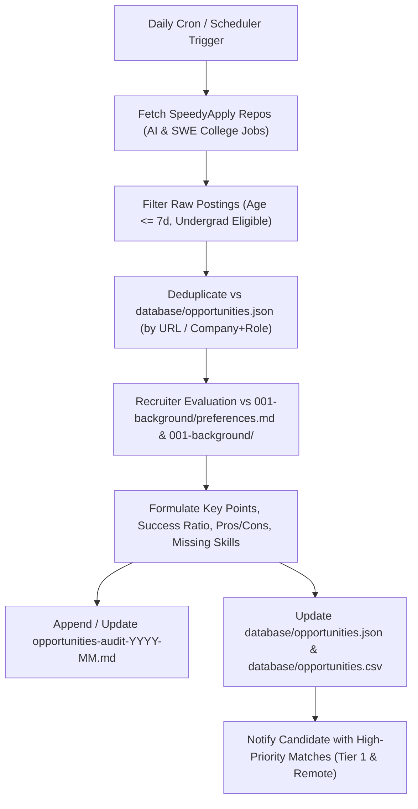

# Opportunities Database & Triage Registry

## 1. Overview
This database serves as the structured registry for all evaluated job, internship, and co-op opportunities. It bridges the raw scrape feeds from GitHub curation repositories (e.g. `2027-AI-College-Jobs` and `2027-SWE-College-Jobs`) with the candidate profile and ground truth constraints in `001-background/preferences.md`.

- **JSON Master File:** [`004-work-opportunities/database/opportunities.json`](opportunities.json)
- **Archived Registry:** [`004-work-opportunities/database/archived_opportunities.json`](archived_opportunities.json)
- **CSV Export:** [`004-work-opportunities/database/opportunities.csv`](opportunities.csv)

---

## 2. Candidate Constraints & Dynamic Baseline
All candidate evaluation criteria must dynamically respect [`001-background/preferences.json`](../../001-background/preferences.json) and [`001-background/preferences.md`](../../001-background/preferences.md).

> [!NOTE] Dynamic Source of Truth
> Never duplicate or hardcode evaluation rules or static location constraints here. Always inspect `001-background/preferences.json` directly at runtime for current career goals, degree standing, home location (`current_location`), work authorization (`us_work_authorization`), work arrangements, compensation floors, domain interests, and dealbreakers. When preferences are updated in the future, all downstream opportunity triaging and database records dynamically adapt to reflect those changes.

---

## 3. Database Schema Reference

| Field | Type | Description |
| :--- | :--- | :--- |
| `id` | string | Unique slug identifier (e.g., `opp-01-salesforce-ai-builder-intern-domestic`). |
| `numeric_id` | integer | Sequential tracking index. |
| `company` | string | Employer or sponsoring enterprise name. |
| `role` | string | Exact title of the position. |
| `tier` | string | Stratified priority bucket (`Tier 1: Domestic / Home Market (Maximum Viability)`, `Tier 2: Remote Part-Time & Flexible`, `Tier 3: Sponsoring Target Hubs`, `Tier 4: Global Co-op / International Hubs`). |
| `location` | string | Geographic location and work style (Remote, Hybrid, Onsite). |
| `work_arrangement` | string | Term duration and schedule type (e.g. Part-time, Summer 2027, 4-Mo Co-op). |
| `hours_per_week` | string | Estimated hours required (`20-30` or `40`). |
| `compensation` | string | Hourly pay, stipend, or standard corporate rate. |
| `realistic_success_ratio` | string | Recruiter screening pass probability range (e.g., `85% - 90%`). |
| `success_ratio_min` / `max` | float | Decimal bounds (`0.85`, `0.90`) for numerical querying and sorting. |
| `success_ratio_justification` | string | Grounded recruiter rationale explaining why this ratio was assigned. |
| `urgency` | string | Time-sensitivity flag (e.g., `⚠️ URGENT: Closes Sep 21!`, `High (Posted 1d ago)`). |
| `strategic_action` | string | Next immediate operational step (e.g., `Immediate Apply (Tier 1)`, `Apply via University Agreement`, `Direct Outreach`). |
| `source_repo` | string | Upstream repository URL where the job was discovered. |
| `apply_url` | string | Direct portal URL to submit application. |
| `file_reference` | string | Local HTML dossier path under `004-work-opportunities/opportunities/`. |
| `vault_note` | string | Path to dedicated Markdown note under `004-work-opportunities/eligible/` if created. |
| `status` | string | Vault eligibility status (`eligible`, `non-eligible`, `archived`). |
| `application_status` | string | Pipeline lifecycle state (`pending_tailoring`, `ready_to_apply`, `applied`, `interviewing`, `rejected`, `offer`). |
| `key_points_to_highlight` | array[string] | Tailored bullet recommendations mapped directly to projects in `001-background/`. |
| `key_considerations` | array[string] | University agreements, visa terms, course schedules, or required documents. |
| `pros` | array[string] | Strategic career advantages. |
| `cons` | array[string] | Trade-offs, risks, or schedule conflicts. |
| `missing_or_bridge_skills` | array[string] | Explicit skill gaps and the recommended bridging action. |
| `date_identified` | string | Date when first discovered (`YYYY-MM-DD`). |
| `last_audited` | string | Date when last re-evaluated (`YYYY-MM-DD`). |

---

## 4. Stratified Priority Tiers

1. **Tier 1: Maximum Viability — Domestic / Home Market (Direct Legal Match & Zero Visa Barrier)**
   - *Target:* Roles based in the candidate's home country, state/province, or metro region (dynamically derived from `current_location` in `001-background/preferences.json`), or domestic legal entities.
   - *Fit:* 80% – 95% pass rate. Perfect alignment with local employment authorization and zero visa friction.
2. **Tier 2: High Viability — Part-Time & Fully Remote AI / Data / SWE Roles**
   - *Target:* Remote roles allowing 20–30 hours/week or global independent contractor arrangements (e.g., W-8BEN, EOR, Deel/Remote).
   - *Fit:* 60% – 85% pass rate. Highly compatible with university lecture schedules and geographic flexibility.
3. **Tier 3: Sponsoring Target Hubs (Top Tech & Quant with Documented Sponsorship)**
   - *Target:* Highly selective internships and co-ops in target hubs (e.g., US summer programs with J-1 visa sponsorship, UK/EU sponsored roles, or domestic elite programs if home-authorized).
   - *Fit:* 20% – 50% pass rate. High compensation ($55 – $125/hr); requires rigorous technical/algorithmic screening and visa sponsorship verification.
4. **Tier 4: Global Co-op & International Innovation Hubs**
   - *Target:* 4-to-6 month international co-ops (Canada, Europe, APAC) offering youth mobility, student work permits, or bilateral exchange agreements.
   - *Fit:* 25% – 55% pass rate. May require coordinating study leaves or credit transfers with the candidate's home university.

---

## 5. Daily Scheduler Automation Lifecycle

