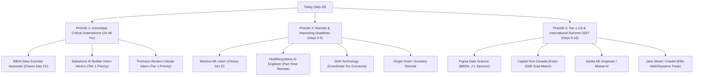

# Comprehensive Opportunities Audit & Strategic Roadmap

**Evaluation Date:** September 20, 2026  
**Candidate:** Diego Perea León (B.S. Data Science & Mathematics, Tecnológico de Monterrey, Class of May 2028)  
**Scope:** In-depth technical recruitment audit of the 22 viable opportunity dossiers downloaded into `004-work-opportunities/opportunities/`.

---

## Executive Summary & Priority Matrix

| # | Company | Role | Location | Term / Hours | Viability / Pass Rate | Urgency / Deadlines | Strategic Action |
| :-: | :--- | :--- | :--- | :--- | :-: | :--- | :--- |
| **1** | **Salesforce** | AI Builder Intern [Mexico] | Mexico City / Hybrid | Part-Time | **85% - 90%** | High (Posted 9d ago) | **Immediate Apply (Tier 1)** |
| **2** | **Thomson Reuters** | AI Training & Claude Implementation Intern | Mexico City / Hybrid | Part-Time | **85% - 90%** | High (Posted 18d ago) | **Immediate Apply (Tier 1)** |
| **3** | **Shift Technology** | Data Scientist Intern (English Speaker) | Mexico City / Flex | Min 6 Mo (Convenio) | **80% - 85%** | Active (Requires Convenio) | **Apply via Tec Convenio** |
| **4** | **BBVA** | Data Scientist Associate – AI Performance & Evolution | Mexico City / Hybrid | Full-Time Associate | **70% - 75%** | ⚠️ **URGENT: Closes Sep 21!** | **Immediate 1-Click Submit** |
| **5** | **Healthesystems** | Intern - Artificial Intelligence Engineer | Remote | Part-Time (20-30h) | **75% - 80%** | High (Posted 1d ago) | **Apply (Verify Remote/Contractor)** |
| **6** | **Single Grain LLC** | AI Automation Internship | Remote | Flexible | **75% - 80%** | Active (Posted 5d ago) | **Apply (Portfolio Link)** |
| **7** | **Ancestry** | Data Science - AI Document Understanding Co-op | Remote | Co-op | **65% - 70%** | Active (Posted 4d ago) | **Apply (Showcase Multimodal/Vision)** |
| **8** | **Workiva** | Summer 2027 Intern - Machine Learning Engineering | Remote - USA | Summer 2027 | **65% - 70%** | ⚠️ **Closes Oct 2 (11 days left!)** | **Apply (LlamaIndex / Agents fit)** |
| **9** | **Amgen** | Undergrad Intern – Machine Learning Engineer | Remote - USA | Summer 2027 | **60% - 65%** | Active (Posted 6d ago) | **Apply (Data Pipelines / ML)** |
| **10** | **WEX** | AI & Data Platform Engineering Intern | Remote - USA | Summer 2027 (13 wks) | **60% - 65%** | Active (Posted 6d ago) | **Apply (Databricks / Cloud)** |
| **11** | **Cotiviti** | Intern - Gen AI Research Engineer | Remote - USA | Part/Full-Time Flexible | **60% - 65%** | Active (Hiring Now) | **Apply (Healthcare GenAI)** |
| **12** | **Figma** | Data Science Intern (2027) | San Francisco / NYC | Summer ($60/hr) | **45% - 50%** | Top Brand / J-1 Sponsor | **Apply with Strong Stats/Product CV** |
| **13** | **Capital One Canada**| Intern, Data Scientist - Winter 2027 | Toronto, Canada | Winter 2027 (4 Mo) | **50% - 55%** | Active (Matches 2027-2028 Grad) | **Apply with Transcript + CV** |
| **14** | **Adobe** | 2027 Intern - Machine Learning Engineer | San Jose / SF | Summer ($55/hr) | **40% - 45%** | Active (Posted 20d ago) | **Apply (GenAI / PyTorch)** |
| **15** | **EQ Bank** | Intern - Retail Lending AI Engineer | Toronto, Canada | Winter (Jan-Apr 2027) | **50% - 55%** | Active | **Apply (APIs, Agents & LLMs)** |
| **16** | **Ciena** | AI Engineer Intern (Winter 2027) | Ottawa, Canada | Winter 2027 | **45% - 50%** | Active | **Apply (Winter Co-op)** |
| **17** | **Kinaxis** | Co-op/Intern AI Quality, Evaluation & Security | Ottawa, Canada | Winter/Summer 2027 | **50% - 55%** | Active (Posted 3d ago) | **Apply (Evals & Guardrails)** |
| **18** | **Mistral AI** | Applied Scientist (Internship in Paris or London) | Paris / London | 6 Mo (Pathway to Seoul)| **25% - 30%** | Frontier Lab / Extremely High Bar| **Apply (RL & Quantization edge)** |
| **19** | **Jane Street** | Machine Learning Engineer Internship | New York City | Summer ($120/hr) | **15% - 20%** | Elite Quant / World-Class Pool | **Apply (Showcase Ape-X Math/RL)** |
| **20** | **Jane Street** | Data Engineer Internship | New York City | Summer ($120/hr) | **20% - 25%** | Elite Quant / World-Class Pool | **Apply (Low-latency & C++ data)** |
| **21** | **Citadel** | Sector Data Scientist - 2027 Intern (US) | NYC / Miami | Summer ($125/hr) | **15% - 20%** | Top Quant / Rigorous Math Screen | **Apply (Highlight 94 GPA & Math)** |
| **22** | **Lyft** | Data Science Intern, Algorithms | SF / NYC / Toronto | Summer ($58/hr) | **15% - 20%** | High Degree Gate (MS/PhD bias) | **Apply only if submitting for Toronto**|

---

## Tier 1: Maximum Viability — Mexico & LATAM Roles (Direct Legal Match & Zero Visa Barrier)

### 1. Salesforce — AI Builder Intern [Mexico]
- **File Reference:** `AI Builder Intern [Mexico].htm`
- **Location:** Mexico City, Mexico (Flexible Hybrid / Remote Days)
- **Work Arrangement:** Part-time, Fixed Term & Temporary (University Futureforce Program)
- **Key Points & Background Assets to Highlight in CV:**
  - **Autonomous Agents & Tool Calling:** Highlight your practical experience with agentic frameworks (**Antigravity, Claude Code, OpenCode**), autonomous decision loops, and structured tool calling.
  - **Tooling Stack:** Salesforce explicitly highlights that interns work with **Claude, Cursor, and Agentforce**. Highlight your deep daily workflow with Cursor and Claude for code generation, prompt decomposition, and testing.
  - **Prompt Engineering:** Highlight your systematic prompt techniques (Few-shot, Chain-of-Thought, ReAct, XML tagging).
  - **LEIA Leadership:** Highlight co-founding LEIA at Tec de Monterrey, signaling early initiative, curiosity, and rapid execution.
- **Realistic Success Ratio / Screening Pass Rate:** **85% – 90%** (Extremely high pass rate. You are a Mexican national at a top tier university (Tec de Monterrey) studying Data Science & Math, already building agentic workflows).
- **Key Considerations:**
  - Designed for students currently in school. Part-time load is fully compatible with morning lectures.
  - Sits alongside customer-facing teams building production Agentforce solutions for Fortune 500 companies.
- **Pros & Cons:**
  - *Pros:* Massive tier-1 corporate brand; directly aligns with your GenAI/LLM/Agent interests; dedicated mentorship and onboarding buddy.
  - *Cons:* Hybrid office in Mexico City (may require occasional commuting or travel from Querétaro).
- **Skills Gap Analysis (Missing or Bridge Skills):**
  - Salesforce Ecosystem & Agentforce architecture: Complete the free introductory **Salesforce Trailhead** modules on Agentforce and Salesforce Data Cloud before your interview.

---

### 2. Thomson Reuters — AI Training & Claude Implementation Intern
- **File Reference:** `AI Training & Claude Implementation Intern.htm`
- **Location:** Mexico City, Mexico (Mexico Global Center - Flex My Way Hybrid)
- **Work Arrangement:** Part-time
- **Key Points & Background Assets to Highlight in CV:**
  - **Anthropic Claude Expertise:** The JD explicitly states: *"Learn the full breadth of Claude's capabilities (models, artifacts, projects, file analysis, web search, extended thinking)..."* Highlight your comprehensive understanding of Claude 3.5 Sonnet, context window utilization, Claude projects, and system prompt engineering.
  - **Prompt Frameworks & Enablement:** The role uses the **C.R.E.A.T.E.** prompt framework. Highlight your coursework in *Inteligencia Artificial Generativa* and your leadership leading **LEIA AI Workshops** for 30+ students (proven ability to teach AI concepts clearly).
  - **Documentation & Evals:** Mention your practice maintaining comprehensive technical logs and reproducible prompt templates.
- **Realistic Success Ratio / Screening Pass Rate:** **85% – 90%** (Near perfect alignment between your student workshop teaching experience and their enablement mandate).
- **Key Considerations:**
  - Part-time structure built for university students.
  - High focus on education, responsible AI usage, and internal tool adoption.
- **Pros & Cons:**
  - *Pros:* Directly works with cutting-edge Anthropic Claude features; excellent work-life balance (*Flex My Way* policy with 8 weeks remote/year); low barrier to entry for a proactive Tec student.
  - *Cons:* More enablement/training/prompting focused rather than heavy C++/PyTorch low-level model architecture.
- **Skills Gap Analysis (Missing or Bridge Skills):**
  - Enterprise change management & prompt auditing frameworks (e.g., C.R.E.A.T.E. framework). Review Anthropic's official prompt engineering interactive tutorial on GitHub.

---

### 3. Shift Technology — Data Scientist Intern (English Speaker)
- **File Reference:** `Job Application for Data Scientist Intern (English Speaker) at Shift Technology.htm`
- **Location:** Mexico City, Mexico
- **Work Arrangement:** Minimum 6-Month Internship (Requires official University Agreement / Convenio de Prácticas)
- **Key Points & Background Assets to Highlight in CV:**
  - **Applied Mathematics & Algorithmic Rigor:** Shift builds insurance fraud detection and decision agents. Highlight your dual Data Science & Mathematics degree, GPA (94/100), and mathematical modeling rigor.
  - **Object-Oriented Programming (OOP) & SQL:** Mention Python, SQL, and your C# / C++ projects (Labyrinth 3D engine and C++ racing game) to prove software engineering fluency.
  - **Industry Practical Experience:** Highlight your internship at **Aristor Consultoría** building geospatial predictive scoring models.
  - **Bilingual Fluency:** Emphasize fluent English and native Spanish.
- **Realistic Success Ratio / Screening Pass Rate:** **80% – 85%** (Tec de Monterrey provides the mandatory *Convenio de Prácticas Profesionales* standardly).
- **Key Considerations:**
  - Minimum commitment of 6 months.
  - Mandatory university contract (convenio) signed by Tec de Monterrey.
- **Pros & Cons:**
  - *Pros:* High-growth French-founded AI unicorn in insurance automation; heavy mathematical modeling and client interaction; full English-speaking international team.
  - *Cons:* Requires committing for at least 6 months; fraud detection modeling is domain-heavy.
- **Skills Gap Analysis (Missing or Bridge Skills):**
  - Insurance fraud concepts (claims fraud, healthcare abuse patterns) and enterprise SQL optimization. Brush up on advanced SQL window functions and anomaly detection algorithms (Isolation Forests, One-Class SVM).

---

### 4. BBVA — Data Scientist Associate – AI Performance & Evolution
- **File Reference:** `Data Scientist Associate – AI Performance & Evolution (Ciudad de México).htm`
- **Location:** Mexico City (Cuauhtémoc), Mexico (Hybrid)
- **Work Arrangement:** Full-Time Associate (Junior / Early Career)
- **Key Points & Background Assets to Highlight in CV:**
  - **LLM Evals & Golden Datasets:** The JD is obsessed with: *"Liderarás el uso de Evals, Golden Datasets y trazas productivas con el fin de diagnosticar degradaciones y realizar análisis de causa raíz."* Highlight your experience building automated evaluation benchmarks, unit test suites (630 tests in pytest for LEIA), and LLM metrics.
  - **Monitoring & Telemetry:** Highlight your telemetry and dashboard work on **DAVE** (FastAPI, logging, clip buffer) and **Street Fighter Gradio Hub**.
  - **Databricks Sun Holdings Challenge:** Mention your ongoing work in the 13-Week Databricks Challenge for fraud and pricing analytics.
- **Realistic Success Ratio / Screening Pass Rate:** **70% – 75%** (Strong technical match, but it is listed as Full-Time Associate, so you must negotiate flexible hours or confirm if ongoing undergraduate status is accepted).
- **Key Considerations:**
  - ⚠️ **CRITICAL DEADLINE ALERT: Closes on September 21, 2026 (Tomorrow!). Workday profile must be filled out 100%.**
- **Pros & Cons:**
  - *Pros:* Elite Latin American financial institution; very modern technical mandate (AI Observability, LLM Evals, Runbooks); permanent contract opportunity.
  - *Cons:* Listed as Full-time, which would conflict with morning lectures unless remote/hybrid flexibility is negotiated.
- **Skills Gap Analysis (Missing or Bridge Skills):**
  - AI Observability tools (Arize, LangSmith, TruLens) and ITIL incident management runbooks.

---

## Tier 2: High Viability — Part-Time & Fully Remote AI / Data Roles

### 5. Healthesystems — Intern - Artificial Intelligence Engineer
- **File Reference:** `Careers List - Healthesystems.htm`
- **Location:** Remote
- **Work Arrangement:** **Part-Time - Remote**
- **Key Points & Background Assets to Highlight in CV:**
  - **Healthcare / Biometrics AI:** Highlight **DAVE (Driver Attention & Vigilance Engine)**, emphasizing real-time biomechanical analysis (EAR, MAR, eye tracking) and sensor fusion, showing you can handle sensitive human biometric data.
  - **Model Optimization & Pipelines:** Highlight ONNX runtime, PyTorch model deployment, and FastAPI backend engineering.
  - **Time Commitment:** Reiterate availability for **20–30 hours/week**, directly matching their part-time requirement.
- **Realistic Success Ratio / Screening Pass Rate:** **75% – 80%** (Extremely rare: an explicit Part-Time + Remote AI Engineer role posted just 1 day ago).
- **Key Considerations:**
  - Need to verify whether they hire international independent contractors in Mexico or require US residential tax status.
- **Pros & Cons:**
  - *Pros:* Exact match for your 20-30 hrs/week preference; 100% remote; healthcare analytics domain.
  - *Cons:* US corporate entity may require W-8BEN contractor onboarding if you lack US work authorization.
- **Skills Gap Analysis (Missing or Bridge Skills):**
  - Familiarity with HIPAA guidelines and healthcare claims analytics.

---

### 6. Single Grain LLC — AI Automation Internship
- **File Reference:** `AI Automation Internship at Single Grain LLC.htm`
- **Location:** Remote
- **Work Arrangement:** Internship / Flexible Remote
- **Key Points & Background Assets to Highlight in CV:**
  - **Autonomous Agents & Scripting:** JD specifies: *"Design, prompt engineer, and prototype flows in Zapier Agents, n8n, Make.com, Lindy.ai, or custom Python/LangChain scripts."* Highlight your Python, LangChain, LlamaIndex, and agentic workflows.
  - **Vector Databases & RAG:** Highlight your knowledge of vector embeddings, semantic chunking, and ChromaDB / Pinecone.
- **Realistic Success Ratio / Screening Pass Rate:** **75% – 80%** (Single Grain is an agile digital marketing & AI agency known for hiring talent globally with portfolio-based reviews).
- **Key Considerations:**
  - Heavy focus on practical automation tools (n8n, Make, Zapier) and LLM wrappers rather than deep math/research.
- **Pros & Cons:**
  - *Pros:* Fast-moving agency led by Eric Siu; global remote friendly; immediate hands-on agency automation experience.
  - *Cons:* Less focus on deep mathematical data science or low-level ML systems.
- **Skills Gap Analysis (Missing or Bridge Skills):**
  - No-code / low-code workflow builders (n8n, Make.com). Spending 2 hours setting up a sample n8n webhook with a LangChain agent will bridge this 100%.

---

### 7. Ancestry — Data Science - AI Document Understanding Co-op
- **File Reference:** `Data Science - AI Document Understanding, Co-op.htm`
- **Location:** Remote
- **Work Arrangement:** Co-op / Remote Flexible
- **Key Points & Background Assets to Highlight in CV:**
  - **Computer Vision & OCR:** Ancestry specializes in parsing historical handwriting, old census records, and archival documents. Highlight your computer vision work from **DAVE** (MediaPipe, image pre-processing, CLAHE, adaptive filtering).
  - **Multimodal LLMs & Transformers:** Highlight your experience running quantized local vision-language models and fine-tuning.
- **Realistic Success Ratio / Screening Pass Rate:** **65% – 70%** (JD mentions preference for Master's/PhD, but undergraduate candidates with strong portfolio projects and math background are regularly reviewed).
- **Key Considerations:**
  - Confirm co-op dates and remote hiring country allowances.
- **Pros & Cons:**
  - *Pros:* Highly intellectual and challenging problem domain (document parsing, multi-modal layout analysis, vision transformers); fully remote.
  - *Cons:* Preference stated for advanced degree students; large applicant pool.
- **Skills Gap Analysis (Missing or Bridge Skills):**
  - Document layout analysis architectures (LayoutLMv3, Donut, TrOCR).

---

### 8. Workiva — Summer 2027 Intern - Machine Learning Engineering
- **File Reference:** `Summer 2027 Intern - Machine Learning Engineering.htm`
- **Location:** USA - Remote
- **Work Arrangement:** Summer 2027 Internship
- **Key Points & Background Assets to Highlight in CV:**
  - **LlamaIndex & LlamaParse Integration:** The JD explicitly highlights: *"Help integrate tools such as LlamaIndex and LlamaParse into existing workflows. Assist in building and deploying AI Agents to automate data processing and analysis tasks."* This is an exact 1:1 match with your 5th-semester GenAI curriculum!
  - **Testing & Quality Assurance:** Highlight your **630 unit tests in pytest** for LEIA and CI/CD discipline.
- **Realistic Success Ratio / Screening Pass Rate:** **65% – 70%** (Direct tech stack alignment; undergraduate applicants explicitly welcome).
- **Key Considerations:**
  - ⚠️ **DEADLINE: Application closes October 2, 2026 (11 days left!).**
  - Check whether US-Remote requires US citizenship/residency or if they sponsor summer J-1 exchange visas.
- **Pros & Cons:**
  - *Pros:* Exceptional tech stack (LlamaIndex, LlamaParse, autonomous agents, modern ML engineering); structured summer timeline.
  - *Cons:* US remote listing might restrict hiring to US domestic payroll.
- **Skills Gap Analysis (Missing or Bridge Skills):**
  - LlamaParse advanced document chunking configurations.

---

### 9. Amgen — Undergrad Intern – Machine Learning Engineer (Summer 2027)
- **File Reference:** `Undergrad Intern – Machine Learning Engineer – Technology, AI & Data (Summer 2027).htm`
- **Location:** United States - Remote
- **Work Arrangement:** Summer 2027 Undergraduate Internship
- **Key Points & Background Assets to Highlight in CV:**
  - **Scalable Data Pipelines & Clean Code:** Highlight data engineering from the Databricks Sun Holdings challenge and Aristor Consultoría.
  - **Automated Model Training & Evaluation:** Highlight your distributed Ape-X learner/actor training loop and automated metric logging.
  - **Visualization Dashboards:** Mention your React/TypeScript DAVE dashboard and Gradio telemetry interfaces.
- **Realistic Success Ratio / Screening Pass Rate:** **60% – 65%** (Explicitly targeted at undergraduate students; strong biomedical tech brand).
- **Key Considerations:**
  - Requires continuous enrollment in a Bachelor's degree program.
- **Pros & Cons:**
  - *Pros:* Massive biopharma leader; high compensation and structured learning program; dedicated undergraduate cohort.
  - *Cons:* May require US work authorization if payroll cannot support international remote workers.
- **Skills Gap Analysis (Missing or Bridge Skills):**
  - Pharmaceutical data structures (clinical trial datasets, EHR data).

---

### 10. WEX — AI & Data Platform Engineering Intern (Undergraduate)
- **File Reference:** `AI & Data Platform Engineering Intern (Undergraduate).htm`
- **Location:** Remote - USA
- **Work Arrangement:** 13-Week Summer Internship (Late May – Mid August 2027)
- **Key Points & Background Assets to Highlight in CV:**
  - **Data Platform Engineering:** Highlight your distributed Ape-X infrastructure (HTTP communication over Tailscale, GPU learner, CPU actors) and Databricks pipeline development.
  - **Undergraduate Standing:** WEX specifically designed this requisition for undergraduates in computer science, data science, and math.
- **Realistic Success Ratio / Screening Pass Rate:** **60% – 65%**.
- **Key Considerations:**
  - Fixed 13-week summer timeline aligns with Tec de Monterrey summer vacation.
- **Pros & Cons:**
  - *Pros:* FinTech data platform scale; tailored for undergraduates; strong mentorship program.
  - *Cons:* Typical US-remote corporate payroll constraints.
- **Skills Gap Analysis (Missing or Bridge Skills):**
  - Enterprise cloud data warehouses (Snowflake, AWS Glue).

---

### 11. Cotiviti — Intern - Gen AI Research Engineer
- **File Reference:** `Intern - Gen AI Research Engineer (Hiring Now!) in Remote _ Careers at US Nationwide Remote.htm`
- **Location:** US Nationwide Remote
- **Work Arrangement:** Flexible (20–40 hrs/week, minimum one semester up to one year)
- **Key Points & Background Assets to Highlight in CV:**
  - **Healthcare Informatics & GenAI Research:** Highlight your GenAI course work, PEFT/LoRA fine-tuning, and research-backed approach to AI development.
  - **LLM Context & Data Layer:** Highlight your work in model quantization (GGUF, Unsloth, VRAM benchmarking).
- **Realistic Success Ratio / Screening Pass Rate:** **60% – 65%**.
- **Key Considerations:**
  - Allows intern to choose hours between 20 to 40 hours per week.
- **Pros & Cons:**
  - *Pros:* Flexible duration (from one semester to one year); choice of hours (can start at 20-30h during semester); deep GenAI healthcare focus.
  - *Cons:* Corporate careers portal indicates US-Remote focus.
- **Skills Gap Analysis (Missing or Bridge Skills):**
  - Healthcare reimbursement and claims coding validation data (CMS-1500, UB-04).

---

## Tier 3: Elite US Summer 2027 Programs (Top Sponsoring Tech & Quant)

### 12. Figma — Data Science Intern (2027)
- **File Reference:** `Job Application for Data Science Intern (2027) at Figma.htm`
- **Location:** San Francisco, CA or New York, NY Hubs
- **Compensation:** **$60.00 / hour**
- **Work Arrangement:** Summer 2027 Full-Time Internship
- **Key Points & Background Assets to Highlight in CV:**
  - **Rigorous Statistics & Mathematics:** Figma's Data Science team explicitly demands strong statistical foundations and experiment design. Highlight your Mathematics degree, probability theory, hypothesis testing, and academic excellence (94 GPA, PARA program).
  - **End-to-End Ownership:** Highlight how you engineered DAVE from raw sensor data to a production React dashboard, and how you led LEIA's Street Fighter project.
  - **Product Analytics & A/B Testing:** Frame your Aristor Consultoría analytics as data-driven decision-making for product growth.
- **Realistic Success Ratio / Screening Pass Rate:** **45% – 50%** (Figma routinely sponsors J-1 exchange visitor visas for international university students; competition is fierce, but your math background provides a strong edge over pure CS applicants).
- **Key Considerations:**
  - Onsite in San Francisco or NYC during summer (fully paid relocation + top-tier hourly rate).
  - Open to undergraduates.
- **Pros & Cons:**
  - *Pros:* One of the most prestigious product/design tech companies in the world; $60/hr compensation; sponsors international students; exceptional mentorship.
  - *Cons:* Highly competitive global talent pool.
- **Skills Gap Analysis (Missing or Bridge Skills):**
  - Product experimentation at scale (causal inference, CUPED variance reduction, multi-armed bandits).

---

### 13. Adobe — 2027 Intern - Machine Learning Engineer
- **File Reference:** `2027 Intern - Machine Learning Engineer.htm`
- **Location:** San Jose / San Francisco, CA (View all 6 locations)
- **Compensation:** **~$55.00 / hour**
- **Work Arrangement:** Summer 2027 Full-Time Internship
- **Key Points & Background Assets to Highlight in CV:**
  - **Deep Learning Frameworks (PyTorch):** Highlight custom PyTorch implementations, loss functions, and neural network architectures from Street Fighter QR-DQN.
  - **Multimodal AI & Computer Vision:** Highlight DAVE's 3D facial landmark mesh and YOLOv8 pipeline.
  - **Model Optimization:** Mention ONNX runtime, Hailo NPU deployment, and LLM quantization (GGUF).
- **Realistic Success Ratio / Screening Pass Rate:** **40% – 45%** (Adobe sponsors J-1 summer visas; heavy focus on generative media).
- **Key Considerations:**
  - Open to Bachelor's, Master's, and PhD students.
- **Pros & Cons:**
  - *Pros:* Massive global impact in Creative Generative AI (Firefly); high compensation; strong university recruiting machinery.
  - *Cons:* Competes directly against Master's and PhD candidates in the same pool.
- **Skills Gap Analysis (Missing or Bridge Skills):**
  - Diffusion models (Latent Diffusion, ControlNet) and generative image/video architectures.

---

### 14. Lyft — Data Science Intern, Algorithms (Summer 2027)
- **File Reference:** `Lyft Data Science Intern, Algorithms (Summer 2027 - SF_NYC).htm`
- **Location:** San Francisco, CA / New York City / Toronto, Canada
- **Compensation:** **$58.00 / hour**
- **Work Arrangement:** Summer 2027 Full-Time Internship
- **Key Points & Background Assets to Highlight in CV:**
  - **Reinforcement Learning & Dynamic Optimization:** Lyft Algorithms manages dispatch, dynamic pricing, and marketplace balancing. Highlight your **Distributed Ape-X DQN** and Markov Decision Process formulations.
  - **Applied Mathematics & Operations Research:** Emphasize your pure mathematics coursework (optimization, linear algebra, stochastic processes).
- **Realistic Success Ratio / Screening Pass Rate:** **15% – 20% (US) / 30% (Toronto)** (⚠️ **Critical Recruiter Gate:** The JD explicitly states: *"Currently pursuing a Masters or PhD degree in mathematical sciences"*. Undergraduates face an automated filter unless applying to the Toronto office or referred).
- **Key Considerations:**
  - Formal requirement states Masters/PhD. If applying, target the Canadian requisition or obtain an internal referral.
- **Pros & Cons:**
  - *Pros:* One of the premier applied operations research and algorithmic data science teams in tech.
  - *Cons:* Strict automated degree-gate filter for undergraduates.
- **Skills Gap Analysis (Missing or Bridge Skills):**
  - Operations Research solvers (Gurobi, CPLEX, SciPy Linear Programming) and two-sided marketplace dynamics.

---

### 15. Jane Street — Machine Learning Engineer Internship
- **File Reference:** `Machine Learning Engineer Internship, New York __ Jane Street.htm`
- **Location:** New York City, NY
- **Compensation:** **$120.00 / hour ($240,000 annualized base rate)**
- **Work Arrangement:** Summer 2027 Full-Time Internship
- **Key Points & Background Assets to Highlight in CV:**
  - **Quantile Regression & Deep RL:** Highlight your implementation of **Quantile Regression DQN (QR-DQN)**, distributional reinforcement learning, and custom loss formulations. Jane Street values mathematical depth over buzzwords.
  - **Extreme Systems Performance:** Highlight achieving **3,700 FPS per process** in `libretro` headless simulation and distributed actor/learner synchronization.
  - **Academic Rigor:** Highlight your 94 GPA, PARA honors program, and TELMEX Foundation scholarship.
- **Realistic Success Ratio / Screening Pass Rate:** **15% – 20%** (Jane Street has one of the highest technical hiring bars globally, but they evaluate undergraduate mathematics students heavily and provide full J-1 visa sponsorship).
- **Key Considerations:**
  - Multi-round technical interviews focusing on pure algorithmic problem solving, probability puzzles, and mathematical reasoning.
- **Pros & Cons:**
  - *Pros:* Absolute pinnacle of technical prestige and compensation ($120/hr); world-class peer group; sponsors international visas.
  - *Cons:* Intense interview process requiring months of probability and systems preparation.
- **Skills Gap Analysis (Missing or Bridge Skills):**
  - OCaml / Functional Programming concepts, high-frequency low-latency distributed systems.

---

### 16. Jane Street — Data Engineer Internship
- **File Reference:** `Data Engineer Internship, New York __ Jane Street.htm`
- **Location:** New York City, NY
- **Compensation:** **$120.00 / hour**
- **Work Arrangement:** Summer 2027 Full-Time Internship
- **Key Points & Background Assets to Highlight in CV:**
  - **High-Throughput Data Ingestion:** Highlight the shared memory buffer, ring buffer, and distributed state serialization in your Street Fighter and DAVE projects.
  - **Systems Programming:** Highlight your C++ and C# systems work, bit-level WRAM memory reading via Lua, and socket communication.
- **Realistic Success Ratio / Screening Pass Rate:** **20% – 25%**.
- **Key Considerations:**
  - Interviews emphasize clean systems design, data structures, and memory management.
- **Pros & Cons:**
  - *Pros:* Unmatched compensation ($120/hr); elite engineering culture.
  - *Cons:* Extremely high competition from top global CS programs (MIT, Stanford, Waterloo).
- **Skills Gap Analysis (Missing or Bridge Skills):**
  - Low-level network protocols (UDP multicasting, ZeroMQ), Linux kernel tuning.

---

### 17. Citadel — Sector Data Scientist - 2027 Intern (US)
- **File Reference:** `Sector Data Scientist - 2027 Intern (US) - Citadel.htm`
- **Location:** New York City, NY / Miami, FL
- **Compensation:** **$125.00 / hour ($250,000 annualized base rate)**
- **Work Arrangement:** Summer 2027 Full-Time Internship
- **Key Points & Background Assets to Highlight in CV:**
  - **Quantitative Data Analysis:** Highlight your predictive modeling for market potential at Aristor Consultoría and transactional analytics in the Databricks challenge.
  - **Statistical Rigor & Math Honors:** Put your B.S. in Mathematics front and center, emphasizing stochastic modeling, calculus, and linear algebra.
- **Realistic Success Ratio / Screening Pass Rate:** **15% – 20%** (Elite hedge fund screening bar; J-1 visa sponsorship guaranteed for accepted candidates).
- **Key Considerations:**
  - Requires strong mental math, statistical intuition, and Python data manipulation skills.
- **Pros & Cons:**
  - *Pros:* Industry-leading compensation ($125/hr); unmatched financial data access; luxury corporate housing.
  - *Cons:* High-pressure performance culture.
- **Skills Gap Analysis (Missing or Bridge Skills):**
  - Financial statement analysis, fundamental equity valuation, and alternative data parsing.

---

## Tier 4: Canadian AI Co-op & International Innovation Hubs

### 18. Capital One Canada — Intern, Data Scientist (Winter 2027)
- **File Reference:** `Intern, Data Scientist - Winter 2027.htm`
- **Location:** Toronto, Ontario, Canada (161 Bay Street)
- **Work Arrangement:** 4-Month Winter Co-op (January – April 2027)
- **Key Points & Background Assets to Highlight in CV:**
  - 🎯 **Exact Graduation Window Match:** Basic qualifications state: *"Will obtain a Bachelor’s degree or higher between September 2027 and September 2028."* (You graduate in May 2028 — perfect fit!).
  - **Data Warehousing & Pipelines:** Highlight SQL, Python, Snowflake concepts, and pipeline building from the Databricks challenge.
  - **Transcript Submission:** Note that Capital One Canada **requires** attaching your official/unofficial transcript in the same PDF as your resume.
- **Realistic Success Ratio / Screening Pass Rate:** **50% – 55%** (Your graduation date aligns 100% with their mandatory hiring bracket).
- **Key Considerations:**
  - Requires temporary relocation to Toronto for the 4-month winter term (Jan–Apr 2027). You would need a Canadian co-op work permit / working holiday or company visa support.
- **Pros & Cons:**
  - *Pros:* Perfectly matches your degree year; exceptional fintech data science training; Toronto financial core.
  - *Cons:* Winter term in Toronto requires taking a temporary study leave or online semester at Tec de Monterrey.
- **Skills Gap Analysis (Missing or Bridge Skills):**
  - dbt (data build tool) and Snowflake data modeling.

---

### 19. EQ Bank — Intern - Retail Lending AI Engineer (Winter 2027)
- **File Reference:** `EQ Bank _ Canada's Challenger Bank - Intern - Retail Lending AI Engineer, Winter 2027.htm`
- **Location:** Toronto, Canada (Hybrid)
- **Work Arrangement:** Winter Term (January – April 2027)
- **Key Points & Background Assets to Highlight in CV:**
  - **LLM Integrations & Intelligent Agents:** JD calls for: *"Support development of microservices, LLM integrations, intelligent agents, and workflow automations."* Highlight your agentic harness experience and FastAPI backends.
  - **RESTful APIs & Unit Testing:** Highlight FastAPI, Docker containerization, and your 630 pytest automated tests.
- **Realistic Success Ratio / Screening Pass Rate:** **50% – 55%**.
- **Key Considerations:**
  - Canadian challenger bank; hybrid in Toronto.
- **Pros & Cons:**
  - *Pros:* Innovative modern stack; focus on AI agents in banking; competitive Canadian banking compensation.
  - *Cons:* Canadian work authorization / co-op visa needed.
- **Skills Gap Analysis (Missing or Bridge Skills):**
  - Microsoft Power Platform, Spring MVC / Java microservices.

---

### 20. Ciena — AI Engineer Intern (Winter 2027)
- **File Reference:** `AI Engineer Intern (Winter 2027).htm`
- **Location:** Ottawa, Ontario, Canada
- **Work Arrangement:** Winter 2027 Co-op
- **Key Points & Background Assets to Highlight in CV:**
  - **Networking / Edge ML:** Highlight Hailo-8 NPU on Raspberry Pi 5 edge acceleration and low-latency inference from DAVE.
  - **Python & C++ Systems:** Highlight your dual proficiency in high-level Python and low-level C++.
- **Realistic Success Ratio / Screening Pass Rate:** **45% – 50%**.
- **Key Considerations:**
  - Telecommunications and optical networking hardware leader.
- **Pros & Cons:**
  - *Pros:* Strong edge and networking AI applications; highly respected Canadian R&D lab.
  - *Cons:* Canadian student co-op preference.
- **Skills Gap Analysis (Missing or Bridge Skills):**
  - Optical telecommunications protocols and telemetry data parsing.

---

### 21. Kinaxis — Co-op/Intern AI Quality, Evaluation & Security
- **File Reference:** `Co-op_Intern AI Quality, Evaluation & Security in Ottawa, Ontario _ Careers at Ottawa Headquarters.htm`
- **Location:** Ottawa, Ontario, Canada
- **Work Arrangement:** Co-op / Internship
- **Key Points & Background Assets to Highlight in CV:**
  - **AI Evals & Security Guardrails:** Highlight your work with automated testing, bit-for-bit parity validation, and model verification.
  - **Supply Chain Analytics:** Highlight your business analytics experience with INEGI microdata and Databricks sales/pricing data.
- **Realistic Success Ratio / Screening Pass Rate:** **50% – 55%**.
- **Key Considerations:**
  - Focuses heavily on the safety, reliability, and security of enterprise supply chain AI models.
- **Pros & Cons:**
  - *Pros:* Rapidly expanding field of AI Security, Red Teaming, and Automated Evaluation; premier Canadian enterprise software company.
  - *Cons:* Ottawa location; requires co-op work visa.
- **Skills Gap Analysis (Missing or Bridge Skills):**
  - OWASP Top 10 for LLMs, prompt injection defense, and automated red-teaming harnesses.

---

### 22. Mistral AI — Applied Scientist (Internship in Paris or London)
- **File Reference:** `Applied Scientist (Internship in Paris or London) @ Mistral.htm`
- **Location:** Paris, France or London, UK (With full pathway to Seoul, South Korea)
- **Work Arrangement:** 6-Month Full-Time Internship (Full visa sponsorship provided)
- **Key Points & Background Assets to Highlight in CV:**
  - **Open-Weights & Quantization Mastery:** Mistral is the world's leading open-weights frontier lab. Highlight your hands-on work with **Unsloth, GGUF quantization, VRAM benchmarking, and local Ollama deployment**.
  - **Reinforcement Learning from Human Feedback (RLHF) / Math Depth:** Highlight your deep RL expertise with Ape-X DQN and your formal mathematical foundations in probability and linear algebra.
  - **Clean, High-Performance Code:** Highlight writing modular, fault-tolerant Python code backed by comprehensive test suites.
- **Realistic Success Ratio / Screening Pass Rate:** **25% – 30%** (Frontier lab with an extraordinarily high hiring bar, but **they provide complete visa sponsorship and relocation support**; your quantization and math focus fits their technical ethos perfectly).
- **Key Considerations:**
  - 6-month commitment based in Paris or London, designed as a direct pipeline into a full-time role in their Seoul office.
- **Pros & Cons:**
  - *Pros:* Working directly at the cutting edge of frontier foundation models (Mistral Large, Codestral, Pixtral); full European visa sponsorship + relocation covered; unmatched prestige.
  - *Cons:* 6 months abroad requires academic deferral or semester leave at Tec; extreme international competition.
- **Skills Gap Analysis (Missing or Bridge Skills):**
  - Distributed GPU training orchestration (Megatron-LM, DeepSpeed, FSDP) and FlashAttention kernel optimization.

---

## Strategic Action Plan & Application Roadmap

### Action Checklist for Diego
1. **Tonight / Tomorrow Morning (Sep 21):** Submit the **BBVA** application before the portal closes at midnight.
2. **Next 48 Hours:** Generate tailored CVs using `002-cv/Custom/` for **Salesforce AI Builder Intern** and **Thomson Reuters Claude Intern**. Both are in Mexico, part-time, and represent your highest probability / highest impact matches.
3. **By October 1:** Complete the **Workiva** application emphasizing LlamaIndex, LlamaParse, and agentic workflows before the October 2 cutoff.
4. **By October 5:** Submit applications for **Figma** and **Capital One Canada** (combining resume + transcript into one PDF).
